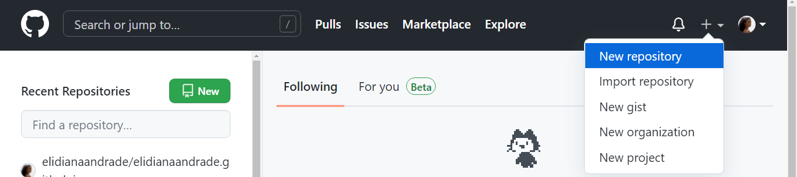
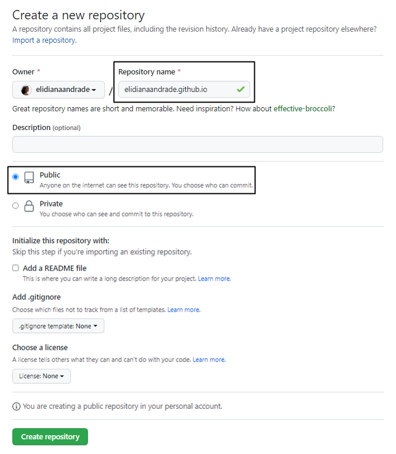
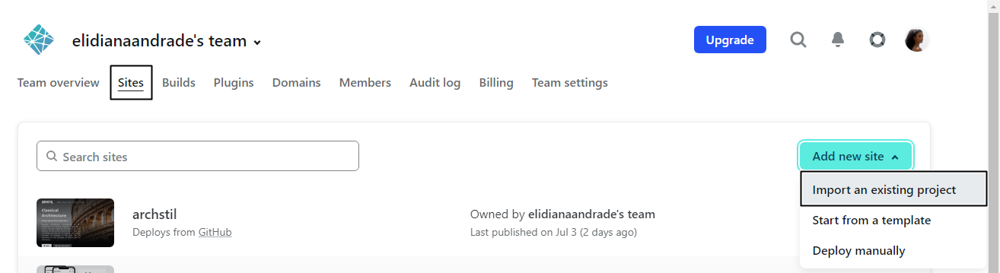

# Aprenda a publicar seu Desafio de Projeto

<figure><figcaption></figcaption></figure>

Concluiu seu Desafio de Projeto, mas ainda não sabe como publicá-lo para que outras pessoas acessem? Este artigo é para você! Depois de trazer algumas dicas sobre [como não travar no Desafio de Código](https://web.dio.me/articles/destrave-seu-primeiro-desafio-de-codigo), aproveitei o pedido de um colega para abordar outra dúvida que assola quem está iniciando: como colocar meu site no ar?

### Resumo

Os Desafios de Projeto da Digital Innovation One - DIO, contam com diversos temas que muitas vezes resultam na construção de uma página web. Seja recriando a interface da Netflix, a página inicial do instagram, ou uma landing page, ao finalizar o desafio surge então a vontade de publicar o projeto para compartilhar o resultado com outras pessoas. Tendo em vista isso, será abordado neste artigo diferentes formas de hospedar seu projeto gratuitamente, além de como tratar possíveis erros que podem ocorrer após a publicação.\
**Palavras-chave:** Desafios de Projeto, Localhost, Deploy, Github.

### 1. Introdução

Ao realizar um projeto na sua máquina, você consegue visualizá-lo localmente através do localhost, que basicamente te direciona a um ambiente que existe apenas na sua máquina, logo, por não ter conexão com a internet, outras pessoas não conseguem acessá-lo digitando, por exemplo, “localhost:numerodaporta/index.html” ou “127.0.0.1:numerodaporta/index.html” – onde “127.0.0.1”, refere-se ao endereço de IP (Internet Protocol) do localhost.\
Para que outras pessoas consigam ver seu projeto, é necessário subir ele para um servidor de hospedagem, assim elas conseguirão acessá-lo por meio de uma URL (Uniform Resource Locator), que é basicamente o endereço eletrônico do seu site.\
O termo deploy (em português “implantar”), de maneira simplista, refere-se ao processo de colocar uma aplicação no ar. Embora esse processo envolva outros aspectos, decidi abordar aqui de maneira básica, pois esse termo irá aparecer em alguns momentos e o objetivo deste artigo é dar uma introdução para quem está começando e deseja publicar seus projetos. Agora que você já entende alguns termos e um pouco sobre como funciona “por baixo de panos”, vamos para o passo a passo de como colocar sua aplicação no ar!

### 2. Como publicar sua página com Github Pages

O passo a passo para criar uma página com o Github Pages pode ser acessado na própria documentação disponível em Github Docs, e foi a referência utilizada neste tutorial.\
Tendo em vista que o Github Pages possui algumas limitações, você deve utilizá-lo para hospedar projetos simples, feitos com HTML, CSS e JavaScript, como é o caso dos primeiros Desafios de Projeto.\
Antes de iniciar, é necessário que você possua uma conta no Github. Para isso, basta acessar < https://github.com/signup > e seguir as instruções para realizar o cadastro.\

#### 2.1 Criando a página principal .github.io

Antes de ensinar a publicar o projeto, vou abordar como criar um repositório com a URL seunomedeusuario.github.io, que você poderá utilizar como sua página principal, criando um portfólio onde pode listar os desafios que já realizou e direcionar para a página de cada projeto. Para isso, basta acompanhar os seguintes passos:\
**PASSO 01 - Crie um novo repositório**\
Na página inicial do Github, você pode fazer isso de duas formas: clicando no botão verde “New” ao lado esquerdo da tela; ou através menu suspenso ao lado direito da barra superior, clicando no “+”, e em seguida “New repository” (Figura 01).

\
Figura 01 – Interface inicial do Github.

<figure><figcaption></figcaption></figure>

&#x20;Fonte: Github. Elaborado pelo autor.

**PASSO 02 - Nomeie o repositório como .github.io** Ao nomear seu repositório escreva seu nome de usuário e acrescente “.github.io” e marque a opção “Public” e clique em “Create repository“, como pode ser observado no exemplo da Figura 02, onde meu usuário é elidianaandrade, então o repositório foi nomeado como “elidianaandrade.github.io”.\
Obs.: Caso seu nome de usuário contenha letras maiúsculas, digite-o com letras minúsculas.\
Figura 02 – Exemplo criando e nomeando um repositório público no Github. &#x20;

<figure><figcaption></figcaption></figure>

Fonte: Github. Elaborado pelo autor.\
Nota: Se você nomear apenas com seu nome de usuário, criará o profile README, que abordo na postagem 5 dicas para melhorar seu profile README do GitHub.

**PASSO 03 – Adicione um index.md ou index.html**\
Após criar o seu repositório, você poderá acessar sua página digitando na barra de endereço do seu navegador https://seunomedeusuario.github.io/ (substituindo “seunomedeusuario” pelo seu, obviamente).\
Num primeiro momento, ocorrerá o erro 404, pois seu repositório estará vazio, mas você pode resolver isso adicionando um index.md ou index.html no seu repositório. Caso possua um index.html, ele será utilizado ao invés do index.md, mas se não existir nenhum dos dois, será utilizado o README.md.\
Figura 03 – Github Pages Settings seleção de branch ou tema.

<figure><figcaption></figcaption></figure>

Fonte: Github. Elaborado pelo autor.\
Você pode utilizar esse repositório para criar o seu portfólio, adicionando os arquivos na branch main (ou a que você selecionar indo em “Settings”, e selecionando na aba lateral “Pages”, como pode ser observado na Figura 03), ou escolher um tema em “Choose a theme”, para que seja exibido na sua página. Mas como o objetivo deste artigo é ensinar a publicar os Desafios de Projeto, vamos para o próximo tópico onde trataremos disso.

#### 2.2 Como publicar seu Desafio de Projeto com Github Pages

Para exemplificar, vou utilizar o repositório do meu projeto referente ao desafio “Recriando a Interface do Netflix”, cujo qual fiz uma nova versão e nomeei de “ArchStil”. Como abordado anteriormente, seu repositório precisa ter um arquivo index.html, que irá corresponder ao conteúdo exibido na página. Obs.: Caso ainda não saiba como subir seu repositório local para o Github, assista o curso “Introdução ao Git e ao GitHub” com o instrutor Otávio Reis, disponível aqui na plataforma da DIO. Figura 04 – GIF Publicando repositório com Github Pages &#x20;

<figure><figcaption></figcaption></figure>

Fonte: Github. Elaborado pelo autor.

Como pode ser observado no GIF (Figura 04), se resume em 4 passos:\
**PASSO 01** – No seu repositório clique em “Settings”;\
**PASSO 02** – No menu lateral clique em “Pages”;\
**PASSO 03** – Selecione a branch “main” (ou a branch onde estiver com o seu projeto);\
**PASSO 04** – Salve!\
Seguindo essas orientações, você poderá ver o projeto acessando a URL https://seunomedeusuario.github.io/nomedorepositorio, como podemos ver no caso deste exemplo:\
https://elidianaandrade.github.io/archstil/ Você pode navegar pelo seu repositório adicionar o caminho na URL até o arquivo que deseja. Por exemplo, dentro da minha pasta assets, tenho uma chamada img e dentro dela contém a logo archstil-logo.png, então posso acessar da seguinte forma:\
https://elidianaandrade.github.io/archstil/assets/img/archstil-logo.png

### 3. Como publicar seu Desafio de Projeto com Netlify

O primeiro passo é se cadastrar no Netlify, você pode fazer isso acessando o link < https://app.netlify.com/signup >. Você pode se inscrever utilizando sua conta do Github, seu e-mail, ou com outra das opções disponíveis. Cadastro realizado, na página inicial selecione “Sites” no menu superior, em seguida clique em “Add new site”, e selecione “Import an existing project from a Git repository", como no GIF abaixo (Figura 05):\
Figura 05 – GIF Publicando repositório com Netlify. &#x20;

<figure><figcaption></figcaption></figure>

Fonte: Netlify. Elaborado pelo autor.

Em seguida, basta seguir os passos descritos no site, que basicamente se resumem em:\
**PASSO 01** – Conecte-se ao provedor Git (nesse caso, o Github);\
**PASSO 02** – Selecione o repositório do seu desafio;\
**PASSO 03** – Configure o site e faça o deploy!\
Você também pode conferir o passo a passo neste vídeo que consta na documentação: < https://youtu.be/4h8B080Mv4U > (Netlify Docs).

### 4. Outras opções de plataformas para hospedagem

Além do Netlify, você pode contar com outras opções como o Heroku, Vercel, etc. O processo é basicamente o mesmo, basta se cadastrar, criar um projeto e conectar com seu repositório.

* Heroku < https://www.heroku.com/ >
* Vercel < https://vercel.com/>

### 5. Tratando possíveis erros

Uma dúvida muito recorrente nos fóruns se tratando do desafio “Recriando a Interface do Netflix”, é o motivo pelo qual o background adicionando no CSS não está sendo exibido após publicar no Github Pages. Para resolver isso, você pode utilizar o caminho relativo, por exemplo no meu projeto a imagem do background (nesse caso, cover-classic-coliseum-italy.jpg) está dentro da pasta assets > img > covers, então fiz da seguinte forma:\
url('../img/covers/cover-classic-coliseum-italy.jpg'); Onde o “..” indica para retornar uma pasta (nesse caso para a pasta assets), e buscar a imagem a partir dela. Caso eu não adicione, ele vai assumir que o arquivo em questão está na raiz do projeto, e por isso não será exibido o background. Caso esteja realizando o deploy no Netlify, por exemplo, quando há alguma falha no processo, você pode conferir qual erro é exibido no terminal (clicando no seu projeto e indo em “Deploys” no menu superior) e buscar uma solução a partir disso, seja através do que já tem conhecimento ou pesquisando sobre o tipo de erro que está retornando.

### 6. Conclusão

Agora que você já conhece algumas formas de publicar seu site, basta escolher uma delas e compartilhar seu trabalho com outras pessoas.\
Vale ressaltar que caso queira trabalhar com Github Pages, lembre-se que deve se tratar de um projeto básico feito com HTML, CSS e JavaScript. Caso contrário, você pode utilizar uma das outras plataformas indicadas, lembrando sempre de consultar a documentação para verificar os limites e limitações que estão sujeitas, a fim de adotar a que melhor se adequa ao seu projeto.

### Referências

GITHUB Docs. Creating a GitHub Pages site. Disponível em: < https://docs.github.com/en/pages/getting-started-with-github-pages/creating-a-github-pages-site >. Acesso em: 01 jul. 2022.\
GITHUB Docs. About GitHub Pages. Disponível em: < https://docs.github.com/en/pages/getting-started-with-github-pages/about-github-pages >. Acesso em: 01 jul. 2022.\
NETLIFY Docs. Create deploys. Disponível em: < https://docs.netlify.com/site-deploys/create-deploys/ >. Acesso em: 05 jul. 2022.

### Páginas e repositórios de alguns dos Desafios de Projeto que realizei

**Recriando a Interface do Netflix**\
Repositório: < https://github.com/elidianaandrade/archstil >\
Página: < https://archstil.netlify.app/ >.\
**Recriando a página inicial do Instagram**\
Repositório: < https://github.com/elidianaandrade/dio-desafio-instagram >\
Página: < https://dio-desafio-instagram.netlify.app/ >.\
**Progressive Web Application com React para mapear os dados do COVID19 pelo mundo**\
Repositório: < https://github.com/elidianaandrade/dio-desafio-covid19 >\
Página: < https://dio-desafio-covid19.netlify.app/ >.
