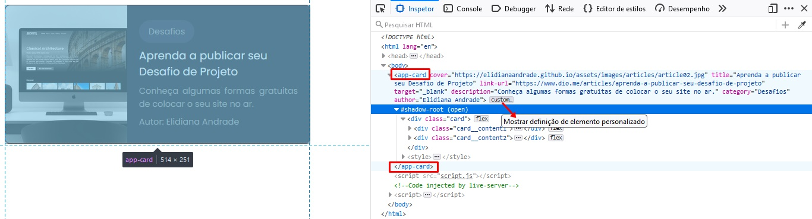
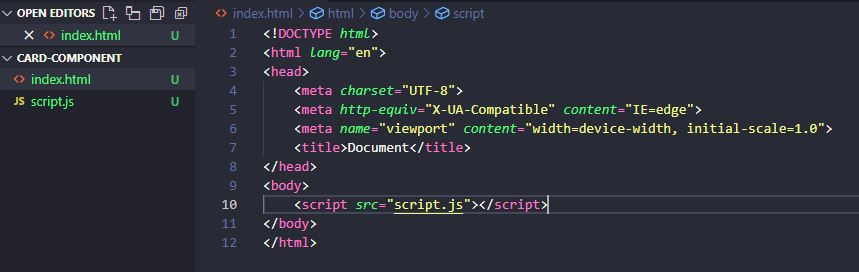
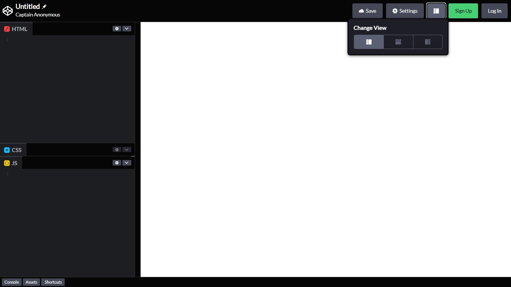
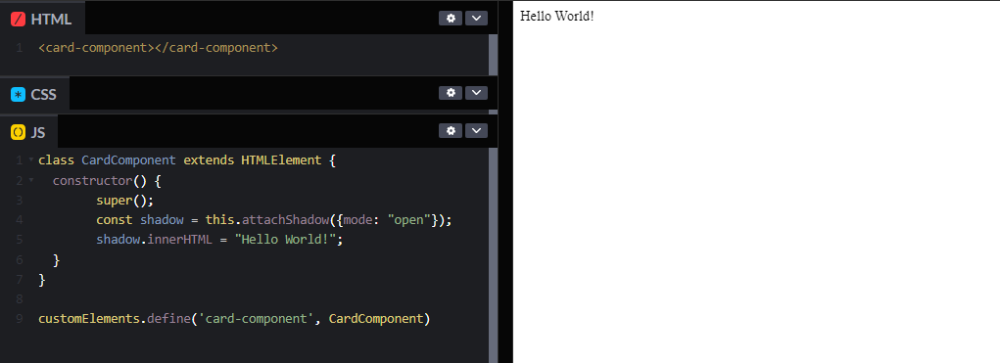
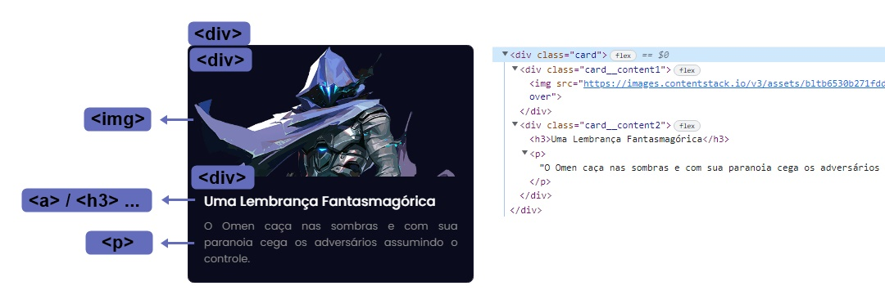
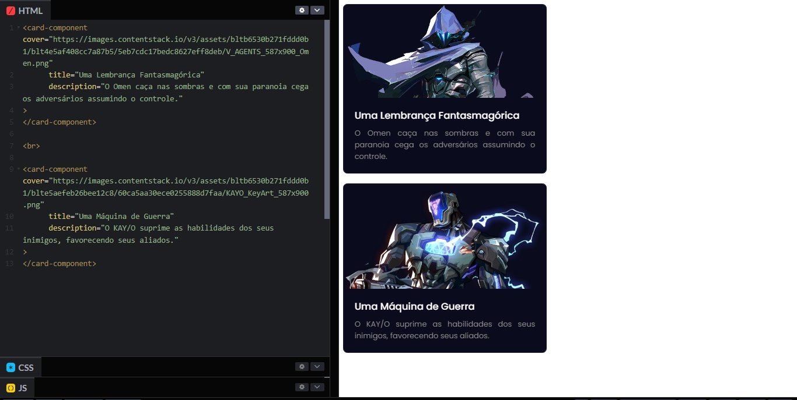

# Crie Seu Próprio Web Component

<figure><figcaption></figcaption></figure>

Explore os conceitos de Web Components, criando seu próprio componente em JavaScript.

No artigo de hoje resolvi sintetizar alguns dos conceitos que estou estudando na Formação Angular aqui na DIO com o instrutor Felipe Aguiar, que são os Web Components no Front-end. Ter essa base é essencial para entendermos o que acontece "por baixo dos panos" quando trabalhamos com componentes.

### Resumo

Os Web Components consistem em elementos customizados, reutilizáveis e independentes, compostos por um conjunto de tecnologias que são agrupadas numa tag HTML personalizada. Sob esse aspecto, a adoção de componentes traz como vantagens a redução da repetição de códigos, facilidade de manutenção e escalabilidade, além melhorar a performance. Nesse sentido, o presente artigo trata acerca do tema de maneira teórica e prática através da criação de um componente.

**Palavras-chave:** Web Components, JavaScript, Shadow DOM.

#### Você vai terminar este artigo sabendo:

* O que é um Web Component?
* Como Identificar um Componente?
* Passos para Criar um Componente
* Considerações Finais
* Referências e Links Utilitários

### O que é um Web Component?

É um conjunto de tecnologias que possibilita criar elementos customizáveis independentes que podem ser reutilizados na aplicação web. Dentre as tecnologias que compõem um Web Componente, temos:

**Custom elements:** Possibilita a criação de elementos personalizados e definição do seu comportamento;

**Shadow DOM:** Árvore "fantasma" anexada ao DOM (Document Object Model), renderizada separadamente;

**HTML templates:** Modelo HTML, "fragmentos" de marcação que podem ser instanciados posterior ao carregamento da página.

Na imagem a seguir, podemos observar que dentro do **Custom Element** "app-card" temos uma subárvore #shadow-root que contém a estrutura HTML do componente e a tag style que agrupa a estilização.

Figura 01 – Inspetor do componente de um card no navegador Firefox.

<figure><figcaption></figcaption></figure>

Fonte: Elaborado pelo autor.

### Como Identificar um Componente?

Meu primeiro contato prático com Componentes foi em Arquitetura (civil), sobretudo em modelagem 3D, e ao me deparar com esse conceito em Desenvolvimento Web percebi que é basicamente a mesma coisa, então para simplificar vou trazer esse exemplo mais "real":

Vamos simular uma maquete eletrônica de edifício residencial com vários apartamentos. Imagine que precisamos modelar as portas de cada um desses apartamentos. Você concorda que seria bem mais fácil criar um único modelo de porta e apenas repeti-lo do que ter que modelar uma por uma? Ao construir esse modelo você está criando um componente! Assim, caso a gente precise alterar o modelo da porta de um apartamento isso irá se repetir automaticamente em todas as portas baseadas neste modelo. Com isso, não teremos o retrabalho de modelar a alteração cada vez que essa porta se repetir, podendo acabar inclusive cometendo o erro de esquecer alguma.

Trazendo para o contexto Web, você já deve ter observado ao visitar alguma página que um conjunto de elementos se repetem numa determinada estrutura. Como por exemplo, um cabeçalho contendo uma logo, menu e um botão. Mas um componente não precisa necessariamente estar presente em todas as páginas, basta que tenha a necessidade de reutilizá-lo. Podemos observar, por exemplo, na aba de artigos da Digital Innovation One, sempre que você abre um artigo, seja ele qual for, a estrutura abaixo pode ser visualizada:

Figura 02 – Interface da página de leitura de artigos da DIO.

<figure><figcaption></figcaption></figure>

Fonte: Digital Innovation One. Elaborado pelo autor.

Além do **cabeçalho**, que se repete em toda a plataforma, podemos observar outros componentes que são comuns a essa área de artigos (Figura 02). Logo abaixo, na direita, temos uma **área para votação** com dois botões e um contador. E em seguida, um **menu de compartilhamento**. Sob esse aspecto, o menu de compartilhamento não depende que a área para votação faça parte dele para que exerça a sua função. Ao contrário do botão do LinkedIn por exemplo, já que o objetivo deste componente é ter um conjunto de elementos que possibilitem compartilhar o conteúdo. Com isso, é coerente que a área de votos e o menu estejam próximos, mas não significa que um dependa do outro para fazer sentido isoladamente.

Figura 03 – Identificando Componentes na página de leitura de artigos da DIO.

<figure><figcaption></figcaption></figure>

Fonte: Digital Innovation One. Elaborado pelo autor.

Além disso, os próprios botões presentes no componente do menu, podem ser baseados no componente botão, por exemplo, contendo características que estão presentes em todos os botões (um círculo com um ícone branco centralizado).

E é com essa mentalidade que podemos ir identificando outros componentes e o momento de utilizá-los. Fazendo isso se reduz a repetição de código, e otimiza o trabalho do desenvolvedor, pois facilita a manutenção possibilitando a alteração automática do modelo de todas as "réplicas" de um mesmo componente, além de melhorar a performance e escalabilidade.

### Passos para Criar um Componente

Como ambiente de desenvolvimento, podemos utilizar o Visual Studio Code e visualizá-lo no navegador, ou editar e visualizar direto no [CodePen](https://codepen.io/).

Caso queira utilizar o Visual Studio Code, crie um arquivo .html e outro .js. No arquivo HTML escreva o comando **html:5** para que ele monte automaticamente a estrutura, e dentro da tag body insira a tag script apontando para o arquivo JavaScript que você criou (Figura 03).

Figura 04 – Arquivo index.html no Visual Studio Code.

<figure><figcaption></figcaption></figure>

Fonte: Visual Studio Code. Elaborado pelo autor.

Já no CodePen, basta acessar < [https://codepen.io/](https://codepen.io/) > e criar uma conta (caso deseje salvar o seu código), ou ir direto para o editor acessando o link: < [https://codepen.io/pen](https://codepen.io/pen) >.

Com o editor de código aberto, você vai visualizar uma interface similar a da imagem abaixo:

Figura 05 – Editor de código (Pen) CodePen.

<figure><figcaption></figcaption></figure>

Fonte: CodePen. Elaborado pelo autor.

Para mudar a forma de visualização, basta clicar no botão no menu superior ao lado de "Settings" como mostrado na Figura 04. Além disso, você também pode minimizar a aba CSS, clicando no segundo ícone e em seguida "Minimize CSS Editor", já que vamos utilizar apenas a de HTML e JavaScript.

Ambiente pronto, agora vamos codar!

#### 01. Crie uma Classe derivada de HTMLElement

Trazendo alguns breves conceitos sobre Programação Orientada a Objetos (POO), uma **classe** é um modelo que abstrai um conjunto de objetos com características em comum. Por exemplo, numa classe cadeira, temos como derivadas as cadeiras de jantar e escolar. Embora uma cadeira de jantar não possua braço como uma escolar, ambas possuem encosto e assento (características similares que serão **herdadas** da sua classe base/pai cadeira)

Voltando para o nosso componente Card, vamos criar uma classe e chamá-la de CardComponent. Você pode nomear da forma que preferir, desde que seja coerente e mantenha o padrão **Pascal Case**, que consiste em escrever a primeira letra das palavras em maiúsculo.

```javascript
class CardComponent extends HTMLElement {}
```

Vamos dizer também que a classe que criamos "**extends**" de HTMLElement, o que significa que desejamos que ela seja derivada/filha da **superclasse** (classe base/pai) \*\*\*\* HTMLElement, e com isso herde os métodos e características dessa interface que representa qualquer elemento HTML.

Em seguida, vamos inserir o método constructor(), e dentro dele vamos adicionar a keyword super() que faz a chamada do constructor de onde a classe estende (nesse caso HTMLElement).

```javascript
class CardComponent extends HTMLElement {
  constructor() {
        super();
  }
}
```

#### 02. Crie uma constante e atribua uma árvore Shadow DOM anexada a Classe

Ainda dentro do constructor da nossa classe, vamos criar a constante shadowRoot e atribuir "this" (que traz a referência de contexto) e o método .attachShadow() que anexa uma árvore Shadow DOM ao elemento especificado, neste caso a nossa classe.

O .attachShadow() receberá como parâmetro o objeto options, e dentro dele o campo **mode**, que pode receber:

"**open**" -> caso queira que seja acessado pelo JavaScript fora do nosso componente;

"**closed**" -> se deseja que seja acessado apenas pelo JavaScript interno.

```javascript
class CardComponent extends HTMLElement {
  constructor() {
        super();
        const shadow = this.attachShadow({mode: "open"});
  }
}
```

#### 03. Defina o Custom Element

Com o customElements chamamos o método .define() para definir nosso elemento customizado. Ele recebe como primeiro parâmetro o seletor, que é o nome da nossa tag HTML, que deverá ser separado por hífen (para diferenciar das tags padrão que contém uma letra/palavra, por exemplo "p" ou "title"). Em seguida, passamos o construtor, nesse caso a classe CardComponent que contém o constructor do nosso elemento.

```javascript
class CardComponent extends HTMLElement {
  constructor() {
        super();
        const shadow = this.attachShadow({mode: "open"});
  }
}

customElements.define('card-component', CardComponent)
```

A partir disso já podemos ter uma prévia do nosso componente chamando nosso seletor `<card-component></card-component>` no HTML, e chamando a nossa constante shadow com a propriedade **`.innerHTML`** para retornar a string "Hello World!", conforme no exemplo abaixo:

```javascript
class CardComponent extends HTMLElement {
  constructor() {
        super();
        const shadow = this.attachShadow({mode: "open"});
        shadow.innerHTML = "Hello World!";
  }
}

customElements.define('card-component', CardComponent)
```

Figura 06 – Editor de código e visualização do componente no CodePen.

<figure><figcaption></figcaption></figure>

Fonte: CodePen. Elaborado pelo autor.

Com essa base, podemos ir desenvolvendo nosso componente de maneira mais rebuscada a partir dos próximos passos.

#### 04. Insira métodos para construção e estilização do componente

Para construir e estilizar o nosso componente vamos inserir dois métodos, um para construirmos a estrutura do nosso componente (**`.build()`**) e outro para estilizá-lo (**`.styles()`**).

E vamos criar um nó na árvore shadow DOM do componente com o método .appendChild() dentro do constructor, onde shadow representa o elemento pai e o this.build() / this.styles() o filho (nó a ser criado).

```javascript
class CardComponent extends HTMLElement {

  constructor() {
        super();
    
        const shadow = this.attachShadow({mode: "open"});
        shadow.appendChild(this.build());
        shadow.appendChild(this.styles());
  }
  
  build(){}
  
  styles(){}
 
}

customElements.define('card-component', CardComponent)
```

Antes de codificar, vamos pensar na estrutura do nosso componente para termos em mente quais elementos vão compor ele. Para facilitar a compreensão através da escrita, será feita uma estrutura bem simples, apenas com imagem e título, mas você pode conferir o exercício que resolvi do curso **Trabalhando com Web Components no Front-end** no meu perfil no [CodePen](https://codepen.io/elidianaandrade/pen/xxjWOVw).

Figura 07 – Estrutura do componente Card.

<figure><figcaption></figcaption></figure>

Fonte: Elaborado pelo autor.

Com isso, dentro do .build() vamos começar declarando a constante componentRoot que será responsável por criar a nossa div principal, e vamos adicionar o atributo class nomeando de "card". Em seguida faremos o mesmo com as divs que vão agrupar o conteúdo 1 e o conteúdo 2 do nosso card, e vamos adicioná-las como filhas do nosso componentRoot, e por fim vamos retorná-lo:

```javascript
class CardComponent extends HTMLElement {

  constructor() {
        super();
    
        const shadow = this.attachShadow({mode: "open"});
        shadow.appendChild(this.build());
        shadow.appendChild(this.styles());
  }
  
  build(){
        const componentRoot = document.createElement("div");
        componentRoot.setAttribute("class", "card");
        
        const content1 = document.createElement("div");
        content1.setAttribute("class", "card__content1");
        
        const content2 = document.createElement("div");
        content2.setAttribute("class", "card__content2");
        
        componentRoot.appendChild(content1);
        componentRoot.appendChild(content2);

    return componentRoot;
  }
  
  styles(){}
 
}

customElements.define('card-component', CardComponent)
```

Feito isso, agora vamos adicionar os elementos que queremos em cada uma das divs de conteúdo. Na div "card\_\_content1", vamos inserir uma imagem que será a capa do card. Para isso vamos criar a constante cover, e inserir o atributo src para a URL da imagem e alt para o texto alternativo / descrição da imagem e referencia-los ao nome do atributo que vamos inserir no HTML. Por fim, vamos adicionar a constante cover como filha da nossa content1.

Já na div "card\_\_content2", vamos criar uma constante para o título e outra para a descrição, inserindo-as como filhas da content2:

```javascript
class CardComponent extends HTMLElement {

  constructor() {
        super();
    
        const shadow = this.attachShadow({mode: "open"});
        shadow.appendChild(this.build());
        shadow.appendChild(this.styles());
  }
  
  build(){
        const componentRoot = document.createElement("div");
        componentRoot.setAttribute("class", "card");
        
        // Content 1
        const content1 = document.createElement("div");
        content1.setAttribute("class", "card__content1");
  
        const cover = document.createElement("img");
        cover.src = this.getAttribute("cover")
        cover.alt = "Card Cover";

        content1.appendChild(cover);
        
        // Content 2
        const content2 = document.createElement("div");
        content2.setAttribute("class", "card__content2");
        
        const title = document.createElement("h3");
        title.textContent = this.getAttribute("title");

        const description = document.createElement("p");
        description.textContent = this.getAttribute("description");

        content2.appendChild(title);
        content2.appendChild(description);
        
        componentRoot.appendChild(content1);
        componentRoot.appendChild(content2);

    return componentRoot;
  }
  
  styles(){}
 
}

customElements.define('card-component', CardComponent)
```

Para estilizar, basta criar uma constante e atribuir a criação da tag "style" (veja no código abaixo) e retorná-la. Em seguida, utilizando a propriedade .textContent adicione o conteúdo do CSS.

```javascript
class CardComponent extends HTMLElement {

  constructor() {
        super();
    
        const shadow = this.attachShadow({mode: "open"});
        shadow.appendChild(this.build());
        shadow.appendChild(this.styles());
  }
  
  build(){
        const componentRoot = document.createElement("div");
        componentRoot.setAttribute("class", "card");
        
        // Content 1
        const content1 = document.createElement("div");
        content1.setAttribute("class", "card__content1");
  
        const cover = document.createElement("img");
        cover.src = this.getAttribute("cover")
        cover.alt = "Card Cover";

        content1.appendChild(cover);
        
        // Content 2
        const content2 = document.createElement("div");
        content2.setAttribute("class", "card__content2");
        
        const title = document.createElement("h3");
        title.textContent = this.getAttribute("title");

        const description = document.createElement("p");
        description.textContent = this.getAttribute("description");

        content2.appendChild(title);
        content2.appendChild(description);
        
        componentRoot.appendChild(content1);
        componentRoot.appendChild(content2);

    return componentRoot;
  }
  
  styles(){
    const style = document.createElement("style");
    style.textContent = `
       @import"https://fonts.googleapis.com/css2?family=Poppins&display=swap";
       
      .card {
        display: flex;
        flex-direction: column;
        justify-content: space-between;
        align-items: center;
        width: 24rem;
        height: 20rem;
        background-color: #0A0B1C;
        border: 0.1rem solid #181832;
        border-radius: .5rem;
        padding: 0;
        margin: 0;
      }
      
      .card__content1 {
        display: flex;
        flex-direction: column;
        justify-content: top;
        max-width: 100%;
        overflow: hidden;
      }
        
      .card__content1 > img {
         border-radius: .5rem 0 0 .5rem;
         object-fit: cover;
         user-select: none;
      }
      
      .card__content2 {
        display: flex;
        flex-direction: column;
        justify-content: flex-start;
        gap: .5rem;
        padding: 1.25rem;
        font-family: "Poppins", Arial, sans-serif;
        word-break: break-word;
      }
      
      .card__content2 > span {
          font-size: .9rem;
          color: #8B8B8B;
          text-transform: capitalize;
          border-radius: 50rem;
          padding: .5rem 1rem;
          margin-right: auto;
          user-select: none;
      }
      
      .card__content2 > h3 {
          font-size: 1.15rem;
          font-weight: 500;
          color: #FCFCFC;
          margin: 0;
      }
      
      .card__content2 > p {
          font-size: .9rem;
          text-align: justify;
          color: #8B8B8B;
          margin: 0;
      }
      
    ` 
    
    return style;
  }
 
}

customElements.define('card-component', CardComponent)
```

Por fim, no HTML, vamos inserir os atributos que criamos e preencher com o conteúdo desejado:

```html
<card-component                                             
      cover="https://images.contentstack.io/v3/assets/bltb6530b271fddd0b1/blt4e5af408cc7a87b5/5eb7cdc17bedc8627eff8deb/V_AGENTS_587x900_Omen.png"
      title="Uma Lembrança Fantasmagórica"
      description="O Omen caça nas sombras e com sua paranoia cega os adversários assumindo o controle."
>
</card-component>
```

A partir disso podemos replicar a mesma estrutura, alterando apenas o conteúdo de cada card:

Figura 08 – Card Components no CodePen.

<figure><figcaption></figcaption></figure>

Fonte: CodePen. Elaborado pelo autor.

Preview < [https://codepen.io/elidianaandrade/pen/JjvgJdB](https://codepen.io/elidianaandrade/pen/JjvgJdB) >.

### Considerações finais

Neste artigo aprendemos que componentes são do que um conjunto de elementos encapsulados numa tag html que podem ser reutilizados. Sob esse aspecto, foi possível acompanhar passos para criar um componente em JavaScript. Caso queira ver mais recomendo o curso **Web Components no Front-end**, e as referências MDN Web Docs, além de outros que você pode conferir no tópico Referências e Links Utilitários.

Por fim, vale salientar que é interessante ter essa base para compreender como funciona os Web Components, mas hoje temos frameworks e bibliotecas que nos possibilita criar componentes de forma mais prática.

### Referências e Links Utilitários

MDN Web Docs. **Classes**. Disponível em: <[ ](https://developer.mozilla.org/pt-BR/docs/Web/JavaScript/Reference/Classes)[https://developer.mozilla.org/pt-BR/docs/Web/JavaScript/Reference/Classes](https://developer.mozilla.org/pt-BR/docs/Web/JavaScript/Reference/Classes) >.

MDN Web Docs. **CustomElementRegistry.define()**. Disponível em: < [https://developer.mozilla.org/pt-BR/docs/Web/API/CustomElementRegistry/define](https://developer.mozilla.org/pt-BR/docs/Web/API/CustomElementRegistry/define) >;

MDN Web Docs. **Element.attachShadow()**. Disponível em: < [https://developer.mozilla.org/en-US/docs/Web/API/Element/attachShadow](https://developer.mozilla.org/en-US/docs/Web/API/Element/attachShadow) >.

MDN Web Docs. **Web Components**. Disponível em: < [https://developer.mozilla.org/pt-BR/docs/Web/Web\_Components](https://developer.mozilla.org/pt-BR/docs/Web/Web\_Components) >.

WEB COMPONENTS. **Introduction**. Disponível em: < [https://www.webcomponents.org/introduction](https://www.webcomponents.org/introduction) >.

#### Cursos sobre o tema na Digital Innovation One:

**Trabalhando com Web Components no Front-end**. Formação Angular. Instrutor: Felipe Aguiar.

**A arquitetura de componentes e a gestão da complexidade no front-end**. Instrutora: Geovana Ribeiro.

**Programação Orientada a Objetos**. Instrutor: Thiago Leite.

### Este artigo foi útil para você?

Dê um upvote e me conta nos comentários o que você achou 😊💜\
[\
](https://elidianaandrade.github.io/articles) [](https://www.linkedin.com/in/elidianaandrade/) [](https://github.com/elidianaandrade)
