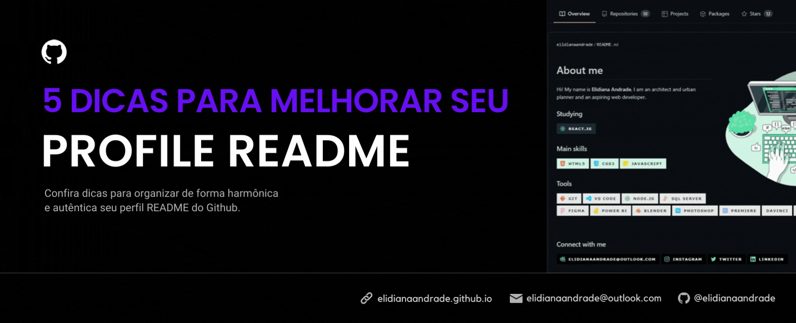

# 2022-04-21-5-dicas-para-melhorar-seu-profile-readme

<figure><figcaption></figcaption></figure>

## 5 Dicas para melhorar o README do seu perfil no GitHub

Na maioria dos casos, a primeira impressão está vinculada ao que é apresentado no perfil. Então nada melhor do que organizar de uma maneira harmônica e autêntica essa apresentação prévia aos demais usuários. Pensando nisso, resolvi separar algumas dicas para melhorar o README do seu perfil GitHub.

\


**Nota:** Caso ainda não saiba como adicionar um README ao seu perfil, é bem simples! Basta criar um novo repositório e nomeá-lo com o seu nome de usuário do GitHub.

\


### 1. Escreva uma breve descrição sobre você <a href="#dica1" id="dica1"></a>

Fale um pouco sobre você. É interessante ser objetivo e falar a área que atua e/ou seus objetivos.

\


### 2. Cite suas skills e redes sociais utilizando Badges <a href="#dica2" id="dica2"></a>

Uma forma de sintetizar e tornar mais objetiva a descrição sobre você, é adicionando Badges para citar suas skills, redes sociais e/ou ferramentas que utiliza, separando por tópicos.

#### Personalizando as Badges

Você pode conferir os parâmetros para personalização em https://shields.io/. Nesse caso, eu utilizei o estilo `style=for-the-badge` e alterei a cor do fundo inserindo o código hexadecimal da cor após o nome (nesse caso Discord), separado por **-** `Discord-6B6D80`, e alterei a cor da logo adicionando `&logoColor=61dafb`.

**Antes**\


```

```

**Depois**\


```

```

\


### 3. Adicione uma ilustração ou imagem que você se identifique <a href="#dica3" id="dica3"></a>


No meu perfil, por exemplo, optei por utilizar essa ilustração que encontrei no [Freepik](https://www.freepik.com/vectors/developer), pois trouxe vários elementos que se conectam comigo.\
Um dos pontos foi o desktop, a maioria das ilustrações que eu encontrava eram desenvolvedores em notebook, e me identifiquei com essa porque utilizo desktop. Além disso, tem o café preto quentinho (a única diferença é que mantenho ele longe do computador 🤣).\


#### Sites com imagens para uso gratuito

\- [Freepik](https://www.freepik.com/vectors/developer) (necessita de atribuição)\
\- [Pexels](https://www.pexels.com/) (a maioria não necessita atribuir os créditos)\
\


### 4. Defina uma paleta de cores harmônica <a href="#dica4" id="dica4"></a>

Caso não tenha uma paleta definida, mas queira utilizar alguma ilustração ou imagem, tome partido da paleta de cores existentes nela para deixar o perfil mais harmônico. Você pode utilizar algum editor de imagem, extensão, ou qualquer outro método para obter o código das cores presentes.\


#### Geradores de paleta de cores online

Outra opção ainda mais simples é utilizar um gerador online, onde você pode inserir uma imagem e gerar uma paleta de cores a partir dela, utilizar alguma existente, ou criar a sua. Algumas opções são:\
\- [Adobe Color](https://color.adobe.com/pt/create/color-wheel)\
\- [Paleta de Cores](https://paletadecores.com/)\


#### Pense no contraste Dark/Light

Ao escolher sua paleta, lembre-se do contraste que as cores adotadas geram nos modos dark / light tendo em vista os diferentes tipos de usuários que vão visitar o seu perfil.

\


\


### 5. Adicione o GitHub Stats <a href="#dica5" id="dica5"></a>

Confira o repositório [GitHub Readme Stats](https://github.com/anuraghazra/github-readme-stats) para ver todos os parâmetros de personalização e os [temas disponíveis](https://github.com/anuraghazra/github-readme-stats/blob/master/themes/README.md).

#### Deixando o fundo com efeito gradiente

Basta adicionar `bg_color=angulo,cor1,cor2`, nesse caso utilizei `bg_color=30,FFF,D6DAFF` com o tema **jolly**, borda branca `border_color=FFF` e texto preto `text_color=000`:


```

```

#### Ocultar o título GitHub Stats

Basta adicionar `&hide_title=true` para ocultar o título:


```

```

\


### DICA BÔNUS: Cuidado com os excessos! <a href="#dica5" id="dica5"></a>

Como dizia Mies van der Rohe: Menos é mais! Cuidado para não se empolgar e encher o perfil com muitas coisas, deixando ele carregado e muitas vezes ilegível pelo volume de informações. Selecione o que for mais importante e principalmente adicione cores harmônicas.

\
[](2022-04-21-5-dicas-para-melhorar-seu-profile-readme.md#top)
