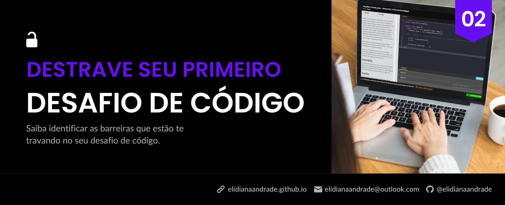
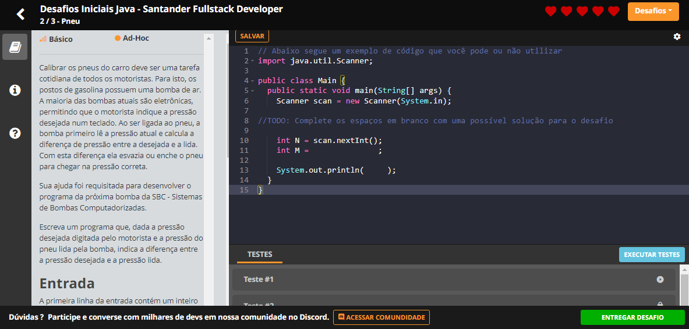
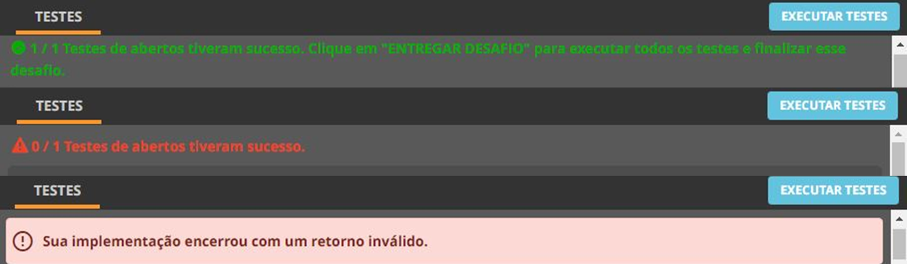
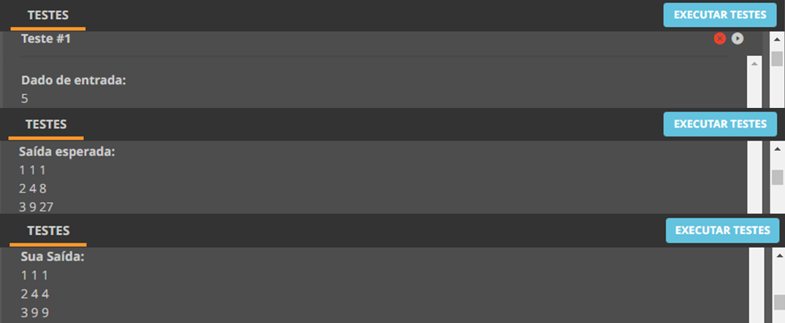

# Destrave seu primeiro Desafio de Código

<figure><figcaption></figcaption></figure>

Neste artigo decidi abordar uma etapa muito importante e que está presente nos Bootcamps da plataforma: os desafios de código. Ao me deparar com o meu primeiro desafio, embora eu reconhecesse que se tratava de uma tarefa simples, acabei travando a princípio até seguir as etapas que abordo neste artigo. Então, como não travar na hora de resolver os desafios de código?

### Resumo

Os desafios de código são atividades práticas que compõem grande parte dos Bootcamps da plataforma da Digital Innovation One – DIO. Embora a comunidade da DIO ofereça todo o suporte para a resolução dos desafios, muitos estudantes, sobretudo os que estão em processo de mudança para a área da programação, possuem certa dificuldade na resolução do seu primeiro desafio. Com isso, o presente artigo tem como objetivo abordar etapas que podem ser adotadas para auxiliar no processo de resolução dos desafios de código, como saber identificar o tipo e a raiz da dificuldade que está tendo, conhecer as formas de buscar ajuda dentro da plataforma e aprender novas abordagens a partir da análise de outras resoluções. Palavras-chave: Desafios de Código, Lógica de Programação, Pensamento Computacional.

### 1. Introdução

Para quem está começando no mundo da programação, sobretudo os que estão em transição de carreira, já devem ter “congelado” ao se deparar pela primeira vez com os desafios de código. Dentro dos Bootcamps da plataforma da Digital Innovation One - DIO, eles estão estrategicamente posicionados logo após o estudante ter todo o conteúdo necessário para resolver aquele desafio. Contudo, a dificuldade pessoal de identificar as ferramentas necessárias e os passos para resolver determinado problema, podem fazer um desafio simples se transformar num bicho de sete cabeças.

Figura 01 – Interface da área de desafios de código da Digital Innovation One – DIO.

<figure><figcaption></figcaption></figure>

Fonte: Digital Innovation One. Elaborado pelo autor.

Os desafios de código geralmente são compostos por um enunciado que descreve o desafio proposto e a entrada e saída esperada, que podem ser lidos na barra lateral esquerda da interface, ao passo que o código pode ser escrito, salvo, e executado ao lado direito, que contém também um exemplo de código que pode ou não ser utilizado na sua resolução. Na parte inferior dessa área onde o código deve ser escrito, possui um conjunto de testes que ele será submetido, sendo alguns abertos, onde você pode verificar o tipo de saída que ele retorna de acordo com a entrada definida, e outros fechados, que não possibilitam essa visualização (Figura 01). Além disso, na barra lateral consta um menu com ícones que levam a abas referentes a descrição do desafio (ícone de livro), instruções para a resolução (ícone “i”) e dúvidas (ícone com a interrogação) que conta também com um tour interativo.

Figura 02 – Tipos de retorno após a execução dos testes do desafio de código.

<figure><figcaption></figcaption></figure>

Fonte: Digital Innovation One. Elaborado pelo autor.

Ao executar os testes clicando no botão azul, existem três possibilidades de retorno, como pode ser observado na Figura 02, sendo o primeiro caso referente a uma implementação que foi submetida com sucesso aos testes abertos; o segundo é retornado quando há um erro na execução do seu código; e o terceiro ocorre quando há um erro de sintaxe, devido a escrita incorreta da estrutura do código indo de desencontro às regras sintáticas da linguagem adotada.

Agora que você já sabe como funciona a interface de resolução dos desafios, a seguir separei algumas dicas de etapas que decorri para começar a solucionar os desafios de maneira mais fluida, e que me ajudaram a não estagnar ao me deparar com novos problemas. Sob esse aspecto, será abordado desde os conhecimentos necessários para se resolver um desafio, assim como identificar as dificuldades que bloqueiam seu progresso na resolução e formas de buscar ajuda e aprender novas abordagens a partir da análise de diferentes resoluções.

### 2. Construa uma base de conhecimento teórico

Da mesma forma que a prática é importante no aprendizado da programação, a teoria não pode ser deixada de lado. É por isso que não adianta assistir algumas aulas e simplesmente pular para os desafios achando que vai conseguir resolver somente na tentativa e erro. Pode acontecer, mas não garante que você esteja aprendendo, e dificilmente irá te ajudar posteriormente na resolução de novos desafios.\
Como abordado na introdução, os desafios são posicionados de maneira estratégica dentro dos Bootcamps da DIO, então é importante para quem está começando seguir essa ordem, de modo a ter a base necessária para a resolução das tarefas práticas. Sob esse aspecto, cursos como os de Lógica de Programação e Pensamento Computacional são essenciais para ter esse olhar sistemático e saber decompor os problemas. Além de ter o conhecimento das regras de sintaxe da linguagem de programação que você está utilizando. Caso ainda esteja tendo dificuldade em interpretar o código exemplo mesmo depois de estudar, tente pesquisar o que cada linha executa e relacionar com exemplos que você tenha visto nas aulas, anotando sempre os pontos em que teve mais dificuldade de aplicar de maneira prática, e definindo a partir disso um novo planejamento para seu estudo teórico. Tenha cuidado para não se autossabotar, achando ser uma “perda de tempo”, às vezes é necessário dar um passo para trás, para em seguida dar dois para a frente.

### 3. Entenda o que o desafio está pedindo

Em alguns casos, talvez a dificuldade em resolver o desafio não esteja na sua capacidade relacionada a programação, e sim na interpretação do que a questão está pedindo. Nesse sentido, tente reescrever o que diz no enunciado com as suas próprias palavras e defina um algoritmo (uma sequência de ações que ao serem executadas levam até a resolução de determinado problema), que permita entregar o que a questão pede. Para facilitar esse processo, você pode começar decompondo um problema complexo em problemas menores, e identificando a ferramenta necessária para resolver esses subproblemas, seja pesquisando o significado de um termo ou sentença que você desconhece, buscando compreender também de que forma esse problema menor se relaciona com o complexo.\
Aqui eu retomo a importância da Lógica de Programação e do Pensamento Computacional, que serão um dos seus principais aliados no direcionamento da solução, então não deixe de conferir, e caso necessário, reassistir o curso de Lógica de Programação Essencial do instrutor Denilson Bonatti, e de Pensamento Computacional da instrutora Juliana Mascarenhas, que estão disponíveis na plataforma da DIO, tentando aplicar esses pontos na resolução do seu desafio. Entender o que são algoritmos, estrutura de repetição e os Pilares do Pensamento Computacional são alguns dos pontos essenciais para que você consiga compreender um desafio e converter numa sequência que leve a resolução de um problema independente da linguagem que for utilizar. A depender do seu caso, vale a pena já estudar e praticar esses conteúdos com a linguagem de programação que deseja estudar no momento. Uma forma de absorver melhor esses assuntos é fazendo resumos e/ou explicando o que entendeu para outra pessoa, ou até para si mesmo, com exemplos que facilitem enxergar aquele determinado conteúdo numa aplicação prática. Caso tenha dificuldade em trabalhar já com a linguagem específica, existem alguns sites com desafios lúdicos que te auxiliam a construir esse pensamento no início dos estudos, como “Minecraft Hour of Code” que pode ser acessado através do link < https://studio.code.org/s/mc/lessons/1/levels/1 >, além de outros que você pode conferir nos cursos da plataforma. Vale salientar também, que a depender da proposta do desafio, sua dificuldade pode estar em disciplinas básicas como português e matemática, então não deixe de revisar caso identifique que seja esse o seu empecilho.

### 4. Leia a documentação

Embora até aqui você já tenha construído uma base teórica, o aprendizado nunca termina. Além de aprender mais sobre a linguagem estudada, ao ler a documentação você vai identificar a maneira mais adequada para o contexto em que está trabalhando, dentre as diferentes formas de se obter um mesmo resultado, e perceber que a sua solução pode ser simplificada.\
A depender da linguagem que está trabalhando, para algumas pessoas ler a documentação pode parecer mais complicado do que simplesmente assistir um vídeo ensinando. Contudo, consultar a documentação vai que te auxiliar na leitura do código, pois nem todos os problemas você encontrará um tutorial ensinando a resolver. Fazer uma busca específica, do que simplesmente ler sem nenhum foco, pode te auxiliar no entendimento da documentação e em como ela está organizada. Aproveite os problemas dos desafios de código para ir em busca de soluções através da leitura, ir com um objetivo definido vai te ajudar a não ficar perdido sobre como começar a ler. Ainda que determinadas soluções não gerem tanto impacto neste começo, se tratando de desafios simples, ter um primeiro contato com diferentes alternativas vão acrescentar mais no seu histórico para futuras resoluções. Um exemplo simplista que posso dar, foi a minha experiência durante a resolução do desafio inicial de JavaScript “Quadrado e ao Cubo”, onde precisava imprimir um valor ao quadrado e ao cubo. Ao invés de multiplicar o mesmo valor até obter o resultado, eu tive a percepção de que essa repetição numa escala maior poderia me gerar problemas. Tendo conhecimento sobre os Operadores Aritméticos em JavaScript, poderia simplesmente utilizar operador de exponenciação (\*\*):

```javascript
// Utilizando o operador de potenciação
let quadrado = i ** 2; // ao invés de let quadrado = i * i;
let cubo = i ** 3; // ao invés de let cubo = i * i * i;
```

E lendo a referência de JavaScript MDN Web Docs, outra forma de calcular essa base elevada ao expoente é com a função Math.pow(base, expoente):

```javascript
// Utilizando o método Math.pow(base, expoente),
let quadrado = Math.pow(i, 2); // ao invés de let quadrado = i * i;
let cubo = Math.pow(i, 3); // ao invés de let cubo = i * i * i;
```

É claro, que nesses desafios mais simples, escolher um ou outro pode não gerar uma diferença significativa, mas acredito que ir construindo esse repertório pode contribuir na resolução de problemas futuros. Apesar de ser um exemplo bem simples, é uma das coisas que aprendi através da leitura, e que me levou a conhecer mais sobre os métodos do objeto Math da linguagem JavaScript. A partir disso, passei a procurar formas de simplificar cada vez mais e descobrir novos métodos, buscando ter o mínimo de noção a respeito de manutenção e expansão, algo que reconheço que é desenvolvido com o tempo através dessa junção entre a teoria e prática. Então, ainda que certas alternativas sejam válidas se tratando de desafios pequenos como esses do começo, é interessante já manter uma mentalidade que pode te auxiliar futuramente.

### 5. Arrisque as primeiras soluções explicando-as passo a passo

É a hora de começar a desenvolver as primeiras linhas do código! Uma opção que pode auxiliar nesse começo, é escrever cada passo como se realmente estivesse explicando para outra pessoa, questões como “Por que utilizou esse método?” “O que essa linha retorna?” “Para que declarou essa variável?” podem parecer óbvias para algumas pessoas, mas para quem está iniciando e não consegue ter isso claro, reconhecer essas necessidades, e sobretudo o motivo de cada escolha que tomou, é essencial nesse processo de aprendizagem. Dessa forma, você consegue identificar se compreendeu de fato o conteúdo e saber quais pontos precisa desenvolver para conseguir solucionar o problema.\
A vantagem de resolver os desafios de código na plataforma, é que você pode ter um retorno dos testes abertos dos desafios, e conferir se está rodando tudo certo antes de enviar. Então ao executar os testes, não se contente em simplesmente saber se está certo ou errado, mas principalmente aproveite para conferir o que o seu código está retornando nos testes abertos. Em muitos casos, isso vai te auxiliar a identificar o que está gerando aquela saída incorreta, como podemos ver na Figura 03, no teste aberto do desafio de código “Quadrado e ao Cubo”, onde ao comparar com a saída esperada podemos observar que o último valor está duplicado, sendo gerado também ao quadrado, ao invés de ao cubo como é pedido no desafio.

Figura 03 – Teste aberto com resultado incorreto no desafio de código “Quadrado e ao Cubo”.

<figure><figcaption></figcaption></figure>

Fonte: Digital Innovation One. Elaborado pelo autor.

Busque primeiro uma solução, para depois melhorá-la. Não passe muito tempo tentando trazer de primeira a melhor solução, dificilmente conseguirá isso sem ter um histórico de resoluções, procure ao menos executar algum código que resolva aquele problema, mesmo que a princípio desconfie que não seja a melhor forma, e em seguida tente buscar alternativas para melhorá-lo a partir de exemplos e comparando com resoluções de outras pessoas.

### 6. Peça ajuda!

É possível que alguém já tenha conseguido resolver alguma parte do código em que você travou, ou não conseguiu identificar o que a questão está pedindo de fato, ou ainda simplesmente reparar que o erro no seu código é falta de uma vírgula (isso é mais comum do que parece). Então não tenha receio em pedir ajuda aos outros usuários da plataforma. Você pode utilizar o Rooms do Bootcamp que está participando e compartilhar seu código e suas dúvidas com os outros estudantes. Além de se ajudar, você pode estar auxiliando outros alunos que tiverem a mesma dúvida posteriormente. Assim como, tem a possibilidade de ver diferentes soluções que as pessoas encontraram e compará-las com o seu resultado.\
Além disso, vale conferir também no fórum dentro do Bootcamp que você está participando, se algum usuário já postou sobre o mesmo assunto, pois é bem provável que a sua questão já tenha sido resolvida na dúvida de outro estudante. Aproveite para comparar com a resolução de outros alunos, e pesquisar os métodos que ele utilizou, ou até mesmo questioná-lo sobre o motivo de ter adotado determinada solução. Você também pode tirar suas dúvidas no servidor da DIO no Discord (link de convite para o servidor), participando das mentorias do Bootcamp, ou em alguma das lives da DIO, geralmente há transmissões específicas sobre o tema, a exemplo “Como resolver os desafios de código na DIO e pensamento computacional” cuja gravação está disponível no canal do Youtube da Digital Innovation One.

### 7. Conclusão

Agora que você já se destravou no seu primeiro desafio de código, continue praticando e compartilhe seus resultados! Pode ser através do seu GitHub ou dentro da comunidade da DIO no fórum específico do Bootcamp, aproveite também para ajudar outros alunos que tiveram as mesmas dúvidas que você. Busque também sempre resolver novos desafios, repetindo os passos que forem necessários para que consiga resolver seu problema. Quanto mais você aumentar o seu repertório, mais fácil vai se tornar resolver desafios futuros.\
Por fim, é válido salientar que essas dicas não necessariamente vão te fazer resolver um desafio em poucos minutos, mas sim, entender quais pontos você precisa melhorar para não bloquear seu avanço. Digo isso, pois também estou iniciando e reconheço que no começo nem sempre terei facilidade na resolução de um desafio, e muitas vezes será necessário revisar algum conteúdo. Então respeite o seu tempo, solidificando sua base teórica e com a prática, progressivamente o primeiro desafio vai parecer cada vez mais fácil para você.

### Referências

DIGITAL INNOVATION ONE. Como resolver os desafios de código na DIO e pensamento computacional. Disponível em: < https://youtu.be/IqLQHHUpHgw >.

DIGITAL INNOVATION ONE. Curso Lógica de Programação Essencial. Disponível em: < https://web.dio.me/course/logica-de-programacao-essencial/learning/aea1ea26-fd56-417d-8272-6e15253f4405/ >.

DIGITAL INNOVATION ONE. Curso Pensamento Computacional. Disponível em: < https://web.dio.me/course/pensamento-computacional/learning/050675c1-8a7f-476b-a778-9b1c7eb75744/ >.
