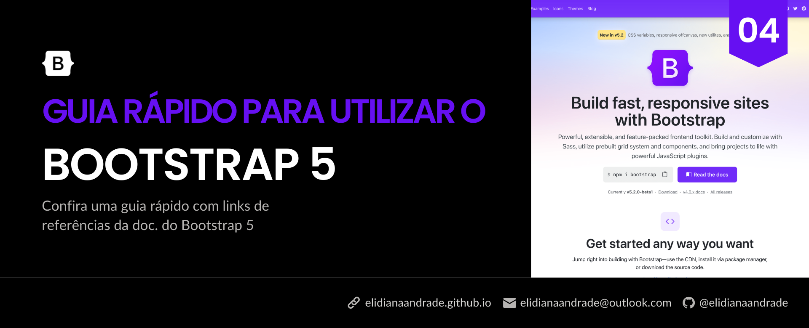

# Guia Rápido para utilizar o Bootstrap 5

<figure><figcaption></figcaption></figure>

Hoje eu trouxe um guia rápido para utilizar o Boostrap, sintetizando as principais ferramentas com diversos links para acesso na documentação, mais especificamente da sua versão 5, a fim de facilitar a busca e compreensão básica acerca do seu uso.

### Resumo

O Bootstrap é um framework para front-end que conta com diversas classes CSS para estilização e estruturação da sua página com HTML, CSS e JavaScript. Dentre as tantas classes para as diversas funcionalidades do Bootstrap, como componentes, containers e utilitários para estilizações, é comum recorrer a documentação para conferir o nome de alguma classe. Contudo, é possível acabar se direcionando a documentação da versão 4, caso não pesquise especificamente, já que pode aparecer primeiro nos mecanismos de pesquisa. Pensando nisso, o objetivo deste artigo é trazer uma síntese das principais ferramentas que o Bootstrap 5 proporciona, trazendo diversos links da documentação para facilitar a busca e compreensão do seu uso.

**Palavras-chave:** Boostrap, CSS, HTML.

### 1. Introdução

A versão 5 do Boostrap foi lançada há 2 anos e dentre as diferenças em relação a anterior está o uso do JavaScript puro no lugar do jQuery (veja mais em “[**Bootstrap 5 alpha!**](https://blog.getbootstrap.com/2020/06/16/bootstrap-5-alpha/)” no blog do Bootstrap). Sob esse aspecto, para quem está começando, caso não se atente, pode acontecer de tentar utilizar uma versão antiga com a nova importada e ocorrer algum erro, tendo em vista que é comum que nos mecanismos de pesquisa a página da versão 4 ainda apareça em primeiro lugar.

Atualmente, temos a versão beta 5.2 do Bootstrap, que trouxe algumas novidades como alguns ajustes suaves no design, novas variáveis CSS para a construção modo dark, etc. Você pode conferir mais sobre a versão beta 5.2 acessando [**Bootstrap 5.2.0 beta**](https://blog.getbootstrap.com/2022/05/13/bootstrap-5-2-0-beta/) no blog do Boostrap. Contudo, pensando na estabilidade, neste artigo, será utilizada a documentação referente a versão 5.0.

A seguir apresento duas formas de adicionar o Boostrap ao seu projeto.

#### 1.1 Adicionando o Bootstrap através do arquivo HTML

Para a referência do CSS, dentro da tag do seu arquivo HTML, insira:

```html
<link href="https://cdn.jsdelivr.net/npm/bootstrap@5.0.2/dist/css/bootstrap.min.css" rel="stylesheet" integrity="sha384-EVSTQN3/azprG1Anm3QDgpJLIm9Nao0Yz1ztcQTwFspd3yD65VohhpuuCOmLASjC" crossorigin="anonymous">
```

Para o JavaScript, você deve colar no final do seu código antes da tag de fechamento do seu arquivo HTML, a fim de garantir que o conteúdo da página seja carregado antes do script (isso é válido para qualquer script, não apenas o do Boostrap).

```html
<script src="https://cdn.jsdelivr.net/npm/bootstrap@5.0.2/dist/js/bootstrap.bundle.min.js" integrity="sha384-MrcW6ZMFYlzcLA8Nl+NtUVF0sA7MsXsP1UyJoMp4YLEuNSfAP+JcXn/tWtIaxVXM" crossorigin="anonymous"></script>
```

#### 1.2 Adicionando o Bootstrap baixando o pacote

Outra opção é baixando o pacote, abaixo eu trouxe os comandos do npm e do yarn:

```bash
npm install bootstrap
```

```bash
yarn add bootstrap
```

Você pode ler mais sobre como iniciar com o Bootstrap acessando < [https://getbootstrap.com/docs/5.0/getting-started/introduction/](https://getbootstrap.com/docs/5.0/getting-started/introduction/) >.

### 2. Ícones

Para adicionar os ícones do Bootstrap, você tanto pode baixá-los no formato SVG e adicionar no seu diretório, quanto como web font (assim como o Font Awesome) ou incorporando o SVG no seu arquivo HTML.

\[LINK DA DOC.] **Ícones**: < [https://icons.getbootstrap.com/](https://icons.getbootstrap.com/) >

#### 2.1 Importação

Você pode tanto incluir na tag no seu HTML, adicionando:

```bash
<link rel="stylesheet" href="https://cdn.jsdelivr.net/npm/bootstrap-icons@1.8.3/font/bootstrap-icons.css">
```

Ou importar no seu arquivo CSS, inserindo:

```bash
@import url("https://cdn.jsdelivr.net/npm/bootstrap-icons@1.8.3/font/bootstrap-icons.css");
```

#### 2.2 Estilização

Você pode estilizá-lo como uma fonte adicionando alguma classe text do Bootstrap, ou adicionando a propriedade color no estilo (no arquivo CSS ou no HTML).

**Ícone**

```html
<i class="bi bi-lightbulb"></i>
```

**Estilização com style no HTML**

```html
<i class="bi bi-lightbulb" style="font-size: 2rem; color: yellow;"></i>
```

**Estilização com classe do Bootstrap**

```html
<i class="bi bi-lightbulb text-warning"></i>
```

Confira as classes de cores na documentação em< [https://getbootstrap.com/docs/5.0/utilities/colors/](https://getbootstrap.com/docs/5.0/utilities/colors/) >.

### 3. Componentes

Para adicionar um componente ao seu projeto, basta copiar o código disponível na documentação e adicionar ao seu arquivo HTML. Abaixo você pode conferir alguns links dos componentes geralmente mais utilizados para consultarem:

* **Navbar** < [https://getbootstrap.com/docs/5.0/components/navbar/](https://getbootstrap.com/docs/5.0/components/navbar/) >
* **Botões** < [https://getbootstrap.com/docs/5.0/components/buttons/](https://getbootstrap.com/docs/5.0/components/buttons/) >
* **Card** < [https://getbootstrap.com/docs/5.0/components/card/](https://getbootstrap.com/docs/5.0/components/card/) >
*   **Slide** <[https://getbootstrap.com/docs/5.0/components/carousel/](https://getbootstrap.com/docs/5.0/components/carousel/) >

    Tendo em vista que o propósito deste artigo é fazer um guia rápido, e falar sobre cada componente iria estender muito, resolvi abordar a seguir algumas classes para estilização no geral.

### 4. Layout

#### 4.1 **Breakpoints**

Os Breakpoints ajudam a tornar sua página responsiva, já que pode definir diferentes estilos para larguras distintas, pré-definidas pelo Bootstrap, como:

* **sm** para dimensões ≥576px
* **md** para dimensões ≥768px
* **lg** para dimensões ≥992px

**Exemplo:** Se eu quero que em dimensões menores que \*\*\*\*576px o display seja flex, e em maiores ou iguais a 576px seja block, eu adiciono d- (de display), e em seguida -flex, depois d- + sm (para dimensões ≥576px) e block, dessa forma:

```html
<div class="d-flex d-sm-block">...</div>
```

Confira outros breakpoints e exemplos acessando a documentação.

\[LINK DA DOC.] **Breakpoints:** <[https://getbootstrap.com/docs/5.0/layout/breakpoints/](https://getbootstrap.com/docs/5.0/layout/breakpoints/)>

### 5. Cores

#### 5.1 Cores dos Textos

Os textos podem ser coloridos adicionando a classe .text- e inserir o nome da cor disponível (consulte a documentação).

```html
<p class="text-primary">Text Primary</p>
```

\[LINK DA DOC.] **Cores**: < [https://getbootstrap.com/docs/5.0/utilities/colors/](https://getbootstrap.com/docs/5.0/utilities/colors/) >

#### 5.2 Cores dos Links

Para colorir um link basta adicionar a classe **.link-** e inserir o nome da cor disponível (consulte a documentação). Diferente do texto, essa classe possui efeito :hover e :focus.

```html
<a href="#" class="link-primary">Primary link</a>
```

\[LINK DA DOC.] **Cores Links**: < [https://getbootstrap.com/docs/5.0/helpers/colored-links/](https://getbootstrap.com/docs/5.0/helpers/colored-links/) >

#### 5.2 Cores para Background

Para adicionar uma cor ao plano de fundo, você deve adicionar a classe **.bg-** e o nome da cor disponível (consulte a documentação).

```html
<div class="bg-primary">Background Primary</div>
```

Você também pode adicionar gradiente, inserindo a classe .bg-gradient, junto com a da cor:

```html
<div class="bg-primary bg-gradient">Background Primary Gradient</div>
```

\[LINK DA DOC.] **Background:** < [https://getbootstrap.com/docs/5.0/utilities/background/](https://getbootstrap.com/docs/5.0/utilities/background/) >

### 6. Bordas

#### 6.1 Adicionar e remover borda

Para adicionar uma borda basta inserir a classe .border, e para remover insira .border-0. Caso queira outras alterações, como por exemplo remover apenas a borda do topo insira a classe .border-top-0, consulte a documentação para ver outros exemplos.

```html
<div class="border">...</div>
<div class="border-0">...</div>
```

#### 6.3 Espessura da borda

Para alterar a espessura da borda, você deve inserir a classe .border- e um número de 1 a 5 (sendo o primeiro mais fino e o quinto com maior espessura).

```html
<div class="border border-1">...</div>
```

#### 6.3 Border-radius

```html


```

#### 6.3 Cor da borda

Para alterar a cor, basta adicionar a classe .border- e inserir o nome da cor, como foi abordado no tópico 5.

```html
<div class="border border-primary">...</div>
```

\[LINK DA DOC.] **Bordas:** < [https://getbootstrap.com/docs/5.0/utilities/borders/](https://getbootstrap.com/docs/5.0/utilities/borders/) >

### 7. Display flex

Para configurar o display é bem simples, basta adicionar a propriedade e o valor, por exemplo: .d-none, .d-grid. Tendo em vista isso, decidi focar no mais utilizado que é o display flex, você pode adicioná-lo inserindo a classe .d-flex, como no exemplo abaixo.

```html
<div class="d-flex"></div>
```

\[LINK DA DOC.] **Display:** < [https://getbootstrap.com/docs/5.0/utilities/display/](https://getbootstrap.com/docs/5.0/utilities/display/) >

\[LINK DA DOC.] **Flex:** < [https://getbootstrap.com/docs/5.0/utilities/flex/](https://getbootstrap.com/docs/5.0/utilities/flex/) >

#### 7.1 Flex-direction

Para inserir a propriedade .flex-direction, basta adicionar a classe .flex- + row ou row-reverse, column ou column-reserve, como nos exemplos abaixo:

```html
<div class="d-flex flex-row">...</div>
<div class="d-flex flex-row-reverse">...</div>

<div class="d-flex flex-column">...</div>
<div class="d-flex flex-column-reverse">...</div>
```

Para utilizar com Breakpoints, segue a mesma lógica apontada no tópico 4.1 (consulte os exemplos na documentação).

#### 7.2 Justify-content

Basta adicionar a classe .justify-content- e inserir around, between, ou o que desejar, como abaixo:

```html
<div class="d-flex justify-content-center">...</div>
```

#### 7.3 Align-items

Para alinhar os itens da sua flexbox, utilize a classe align-items e adicione

Confira também outras propriedades como .align-self, .flex-fill, .flex-grow-, etc acessando \*\*\*\*< [https://getbootstrap.com/docs/5.0/utilities/flex/](https://getbootstrap.com/docs/5.0/utilities/flex/) >

### Conclusão

Neste artigo contamos com um guia rápido sobre o Bootstrap 5 com resumos sobre suas principais funcionalidades e diversos links para acesso direto na documentação. Sob esse aspecto, aprendemos como adicionar o Bootstrap 5 através do HTML e do gerenciador de pacotes, vimos um overview acerca da sua estrutura e ferramentas. Além de apresentar diversos utilitários para a estilização dos componentes e ícones que ele dispõe. Por fim, é válido salientar que o Bootstrap conta com muitas outras ferramentas, então é interessante ler um pouco a documentação caso queira algo específico que não tenha cito citado neste guia.

### Referências

BOOTSTRAP Blog. **Bootstrap 5 alpha!**. 2020. Disponível em: < [https://blog.getbootstrap.com/2020/06/16/bootstrap-5-alpha/](https://blog.getbootstrap.com/2020/06/16/bootstrap-5-alpha/) >.

BOOTSTRAP Blog. **Bootstrap 5.2.0 beta**. 2022. Disponível em: < [https://blog.getbootstrap.com/2022/05/13/bootstrap-5-2-0-beta/](https://blog.getbootstrap.com/2022/05/13/bootstrap-5-2-0-beta/) >.

BOOSTRAP v5.0 Doc. **Introduction**. Disponível em: < [https://getbootstrap.com/docs/5.0/getting-started/introduction/](https://getbootstrap.com/docs/5.0/getting-started/introduction/) >.
