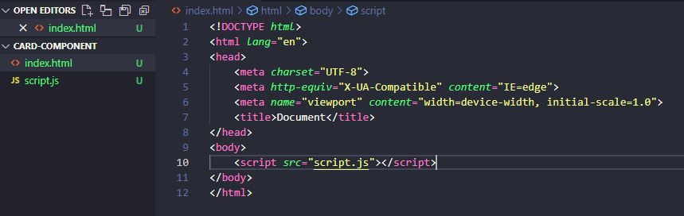
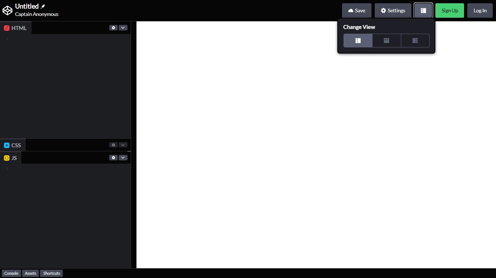

# 2022-10-21-crie-seu-proprio-web-component

Explore os conceitos de Web Components, criando seu próprio componente em JavaScript no CodePen.&#x20;

## Crie Seu Próprio Web Component

### Resumo

&#x20;Os Web Components possuem Com uma estrutura composta pelas Custom Elements, Shadow DOM e HTML templates, possibilitando criar uma tag HTML personalizada que agrupa. Sob esse viés, a adoção de componentes traz como vantagens a redução da repetição de códigos, escalabilidade e facilidade de manutenção além melhorar a performance. Nesse sentido, o presente artigo trata da teoria e prática acerca desses conceitos através da criação de um componente.

**Palavras-chave:** Web Componentes, JavaScript, Shadow DOM.


#### Você vai terminar este artigo sabendo:

* O que é um Web Component?
* Quando utilizar um Componente?
* Passos para Criar um Componente
* Considerações Finais
* Referências e Links Utilitários


### O que é um Web Component?

É um conjunto

Possibilita um código mais limpo, pois evita a repetição d

#### Estrutura de um Web Component

**Custom elements:** Elementos customizados

**Shadow DOM**

**HTML templates**

#### Shadow DOM

### Quando utilizar um Componente?

&#x20;Meu primeiro contato prático com o conceito de Componentes foi em Arquitetura e Urbanismo, e em Desenvolvimento Web é basicamente a mesma coisa, então para simplificar vou trazer esse exemplo mais "real" em arquitetura:

&#x20;Vamos simular uma maquete eletrônica de edifício residencial com vários apartamentos. Imagine que precisamos modelar as portas de cada um desses apartamentos. Você concorda que seria bem mais fácil criar um único modelo de porta e apenas repeti-lo do que ter que modelar uma por uma? Ao construir esse modelo você está criando um componente! Assim, caso a gente precise alterar o modelo da porta de um apartamento isso irá se repetir automaticamente em todas as portas baseadas neste modelo. Com isso, não teremos o retrabalho de modelar a alteração cada vez que essa porta se repetir, podendo acabar inclusive cometendo o erro de esquecer alguma.

Trazendo para o contexto Web, você já deve ter observado ao visitar alguma página que um conjunto de elementos se repetem numa determinada estrutura. Como por exemplo, um cabeçalho contendo uma logo, menu e um botão. Mas um componente não precisa necessariamente estar presente em todas as páginas, como podemos observar, por exemplo, na aba de artigos da Digital Innovation One.

Sempre que você abre um artigo, seja ele qual for, a estrutura abaixo pode ser visualizada:

Figura 01 – Interface da área de leitura do artigo. DIO.

<figure><figcaption></figcaption></figure>

Fonte:&#x20;

Além do **cabeçalho**, que se repete em toda a plataforma, podemos observar outros componentes que são comuns a essa área de artigos (Figura 02). Logo abaixo, na direita, temos uma **área para votação** com dois botões e um contador. E em seguida, um **menu de compartilhamento**. Sob esse aspecto, você concorda que o menu de compartilhamento não depende que a área para votação faça parte dele para que exerça a sua função? Ao contrário do botão do LinkedIn por exemplo, já que o objetivo deste componente é ter um conjunto de elementos que possibilitem compartilhar o conteúdo. Com isso, é coerente que a área de votos e o menu estejam próximos, mas não significa que um dependa do outro para fazer sentido isoladamente.

Figura

<figure><figcaption></figcaption></figure>

Fonte:

Além disso, os próprios botões presentes no componente do menu, podem ser baseados no componente botão, por exemplo, contendo características que estão presentes em todos os botões (um círculo com um ícone branco centralizado).

&#x20;E é com essa mentalidade que podemos ir identificando outros componentes e momento de utilizá-los. Fazendo isso se reduz a repetição de código, facilita a manutenção e escalabilidade, além de melhorar a performance.

A partir disso, a seguir vamos ver de forma prática como criar um componente, trazendo como exemplo um card.

### Passos para Criar um Componente

Como ambiente de desenvolvimento, podemos utilizar o Visual Studio Code e visualizá-lo no navegador, ou editar e visualizar direto no [CodePen](https://codepen.io/) que é uma maneira mais rápida.

Caso queira utilizar o Visual Studio Code, crie um arquivo .html e outro .js. No arquivo HTML escreva o comando **html:5** para que ele monte automaticamente a estrutura, e dentro da tag body insira a tag script apontando para o arquivo JavaScript que você criou (Figura 04).

<figure><figcaption></figcaption></figure>

&#x20;Já no CodePen, basta acessar < [https://codepen.io/](https://codepen.io/) > e criar uma conta (caso deseje salvar o seu código), ou ir direto para o editor acessando o link: < [https://codepen.io/pen](https://codepen.io/pen) >.

Com o editor de código aberto, você vai visualizar uma interface similar a da imagem abaixo:

<figure><figcaption></figcaption></figure>

Para mudar a forma de visualização, basta clicar no botão no menu superior ao lado de "Settings" como mostrado na Figura 03. Além disso, você também pode minimizar a aba CSS, clicando no segundo ícone e em seguida "Minimize CSS Editor", já que vamos utilizar apenas a de HTML e JavaScript.

Ambiente pronto, agora vamos codar!

#### 01. Crie uma Classe derivada de HTMLElement&#x20;

&#x20;Trazendo alguns breves conceitos sobre Programação Orientada a Objetos (POO), uma **classe** é um modelo que abstrai um conjunto de objetos com características em comum. Por exemplo, numa classe cadeira, temos como derivadas as cadeiras de jantar e escolar. Embora uma cadeira de jantar não possua braço como uma escolar, ambas possuem encosto e assento (características similares que serão **herdadas** da sua classe base/pai cadeira)

Voltando para o nosso componente Card, vamos criar uma classe e chamá-la de CardComponent. Você pode nomear da forma que preferir, desde que seja coerente e mantenha o padrão **Pascal Case**, que consiste em escrever a primeira letra das palavras em maiúsculo.

```javascript
class CardComponent extends HTMLElement { }
```

Vamos dizer também que a classe que criamos "**extends**" de HTMLElement, o que significa que desejamos que ela seja derivada/filha da **superclasse** (classe base/pai) **** HTMLElement, e com isso herde os métodos e características dessa interface que representa qualquer elemento HTML.

Em seguida, vamos inserir o método constructor(), e dentro dele vamos adicionar a keyword super() que faz a chamada do constructor de onde a classe estende (nesse caso HTMLElement).

```javascript
class CardComponent extends HTMLElement {
  constructor() {
        super();
  }
}
```

#### 02. Crie uma constante e atribua uma árvore Shadow DOM anexada a Classe

&#x20;Ainda dentro do constructor da nossa classe, vamos criar a constante (neste exemplo chamada shadowRoot) e atribuir "this" (que traz a referência de contexto) e o método .attachShadow() que anexa uma árvore Shadow DOM ao elemento especificado, neste caso a nossa classe.

&#x20; O .attachShadow() receberá como parâmetro  o objeto options, e dentro dele o campo **mode**, que pode receber:

&#x20;"**open**" -> caso queira que seja acessado pelo JavaScript fora do nosso componente;

"**closed**" -> se deseja que seja acessado apenas pelo JavaScript interno.&#x20;

```javascript
class CardComponent extends HTMLElement {
  constructor() {
        super();
        const shadowRoot = this.attachShadow({mode: "open"});
  }
}
```

#### 03. Insira os métodos build() e styles()

```javascript
class CardComponent extends HTMLElement {

  constructor() {
        super();
    
        const shadowRoot = this.attachShadow({mode: "open"});
        shadowRoot.appendChild(this.build());
        shadowRoot.appendChild(this.styles());
  }
  
  build(){}
  
  styles(){}
 
}

```

Dentro do método

#### 05. Defina o Custom Element

Por fim, com o customElements chamamos o método .define() para definir nosso elemento customizado. Ele recebe como primeiro parâmetro o seletor, que é o nome da nossa tag HTML, que deverá ser separado por hífen (para diferenciar das tags padrão que contém uma letra/palavra, por exemplo "p" ou "title"). Em seguida, passamos o construtor, nesse caso passamos a classe ButtonComponent.

```javascript
customElements.define('app-card', CardComponent)
```

### Considerações finais

&#x20;Neste artigo aprendemos que componentes são do que um conjunto de elementos encapsulados numa tag html que podem ser reutilizados. Sob esse aspecto, foi possível acompanhar passos para criar um componente em JavaScript.

Ter essa base é interessante para compreender como funciona, mas hoje temos frameworks e bibliotecas que nos possibilita criar componentes de forma mais prática.

### Referências e Links Utilitários

MDN Web Docs. **Classes**. Disponível em: <[  ](https://developer.mozilla.org/pt-BR/docs/Web/JavaScript/Reference/Classes)[https://developer.mozilla.org/pt-BR/docs/Web/JavaScript/Reference/Classes](https://developer.mozilla.org/pt-BR/docs/Web/JavaScript/Reference/Classes) >.

MDN Web Docs. **CustomElementRegistry.define()**. Disponível em: < [https://developer.mozilla.org/pt-BR/docs/Web/API/CustomElementRegistry/define](https://developer.mozilla.org/pt-BR/docs/Web/API/CustomElementRegistry/define) >;

MDN Web Docs. **Element.attachShadow()**. Disponível em: < [https://developer.mozilla.org/en-US/docs/Web/API/Element/attachShadow](https://developer.mozilla.org/en-US/docs/Web/API/Element/attachShadow) >.

MDN Web Docs. **Web Components**. Disponível em: < [https://developer.mozilla.org/pt-BR/docs/Web/Web\_Components](https://developer.mozilla.org/pt-BR/docs/Web/Web\_Components) >.

WEB COMPONENTS. **Introduction**. Disponível em: < [https://www.webcomponents.org/introduction](https://www.webcomponents.org/introduction) >.

#### Cursos sobre o tema na Digital Innovation One:

**Trabalhando com Web Components no Front-end**. Formação Angular. Instrutor: Felipe Aguiar.

**A arquitetura de componentes e a gestão da complexidade no front-end**. Instrutora: Geovana Ribeiro.

**Programação Orientada a Objetos**. Instrutor: Thiago Leite.

### Este artigo foi útil para você?

Deixe o comentário e curta e compartilhe para que alcance mais pessoas!\
[\
](https://elidianaandrade.github.io/articles) [](https://www.linkedin.com/in/elidianaandrade/) [](https://github.com/elidianaandrade)
