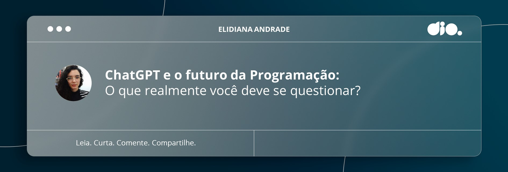
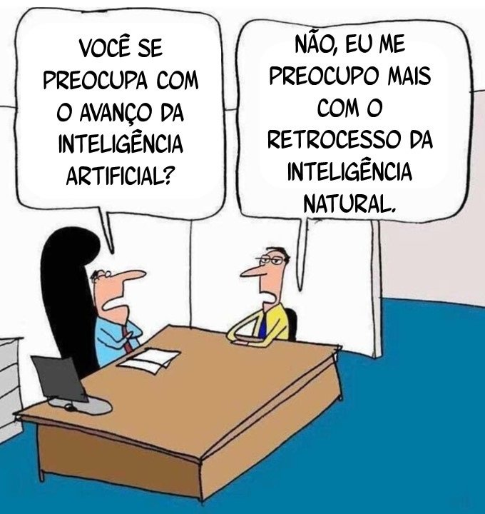

# ChatGPT e o futuro da Programação: O que realmente você deve se questionar?

<figure><figcaption></figcaption></figure>

A alta repercussão gerada pelo crescimento acelerado do ChatGPT tem aberto espaço para notícias alarmistas acerca do futuro da Programação. Nesse cenário, questionamentos sobre a substituição de humanos pela Inteligência Artificial têm garantido novamente espaço entre as discussões. Mas até que ponto isso deve ser considerado?

### Introdução

Produzido pela OpenAI, empresa de pesquisa e implantação de Inteligência Artificial (IA), o   ChatGPT (Chat Generative Pre-trained Transformer) é uma versão ajustada do modelo de linguagem GPT-3.5 projetada para aplicações de chatbot.&#x20;

O Processamento de Linguagem Natural (PLN) apurado, fornecendo saídas muito próximas a linguagem humana, e a ampla variedade na sua base de dados possibilitando o uso em diversos segmentos, tem sido alguns dos pontos que chamam mais atenção.

Em poucos meses de lançamento, seu crescimento acelerado promoveu uma alta repercussão, e dentre os assuntos mais discutidos está a possibilidade de substituição de profissionais pela IA. A seguir, iremos discutir algumas questões que estão por trás dessa discussão.

### Eu sou um Humano ou um Bot?

Antes de se questionar se será ou não substituído por um chatbot, considere refletir sobre o que te leva a pensar que essa troca poderia acontecer, como características e habilidades que podem nos assemelhar e diferenciar dessa tecnologia.

Diariamente somos influenciados pelo conteúdo que consumimos no meio digital e como interagimos com ele. A exemplo o “filtro bolha” afetando os sistemas de buscas e a forma como vemos o mundo, a produção e consumo massivo de conteúdos curtos e superficiais nas redes sociais, compartilhamento de notícias falsas, etc. Nesse contexto, a reprodução de conteúdo sem averiguar a veracidade das informações não é o único problema, tendo em vista que cópias de conteúdos autênticos também impactam negativamente o desenvolvimento do indivíduo.

A superestimação acerca da Inteligência Artificial, faz com que muitos esqueçam que no fim das contas o conteúdo gerado por elas é basicamente fruto do trabalho de humanos “reembalado” como algo novo, como aborda Haggart, professor de Ciência Política da Brock University:

> “Machine-learning models appear sophisticated, but they’re basically just complex autocomplete machines that repackage the work of others as if it were something new, without understanding what they produce.” **HAGGART, B.**

Acerca disso, vale questionar também se estamos entendendo o contexto do que produzimos, ou simplesmente repassando como uma IA.

#### Para além do código

Segundo o [_**Global Code Time Report**_](https://www.software.com/reports/code-time-report) (2022) os desenvolvedores passam cerca de 52 minutos por dia codificando. Além disso, constataram também que apenas 10% gastam mais do que 2h/dia codificando. O que nos mostra que o papel do desenvolvedor vai muito além de codificar, e o fato de um chatbot gerar códigos não o torna um programador.

Entender o contexto da aplicação e quais soluções tomar para cada tipo de cenário, são apenas algumas das atribuições da profissão, que ao menos por um bom tempo, caberá a nós humanos realizar, uma vez que estão ligadas às habilidades comportamentais e competências subjetivas, as _**Soft Skills**_. Pensamento Crítico, Resolução de Problemas Complexos, e Comunicação Empática, são apenas algumas dessas habilidades que também nos tornam humanos e nos diferencia de uma IA.

Figura 01 – Charge de um diálogo entre dois homens numa sala de escritório: -“Você se preocupa com o avanço da Inteligência Artificial?” -”Não, eu me preocupo mais com o retrocesso da inteligência natural.”

<figure><figcaption>
Fonte: Autor Desconhecido.
</figcaption></figure>

&#x20;Manter-se em constante aprendizado, vai te garantir confiança para se adaptar às transformações do mercado. Ainda que no contexto atual a substituição possa não parecer uma alternativa realista, isso não impede que as atribuições das profissões existentes sejam modificadas, assim como ocorra o surgimento de novas, fato que já ocorre há muitos anos. Com isso, vale atentarmos para não superestimarmos seus efeitos a curto prazo, nem subestimar a longo, como aponta a lei de Amara:

> “We tend to overestimate the effect of a technology in the short run and underestimate the effect in the long run.” AMARA, R.

### Estou usando a Ferramenta a meu Favor?

Outro ponto que devemos nos questionar, é sobre o uso que fazemos dessa ferramenta. Estou utilizando como auxiliar ou me tornei um intermediário dos resultados gerados por ela?

Nesse contexto, alguns dos pontos que devem ser considerados são:

#### O Impacto no Aprendizado

A cópia do conteúdo gerado por essa tecnologia, já vem preocupando educadores e pesquisadores. Inclusive sua [proibição como coautor](https://www.theguardian.com/science/2023/jan/26/science-journals-ban-listing-of-chatgpt-as-co-author-on-papers) já vem sendo apontada, visto que recaí não apenas em questões referentes a veracidade das informações prestadas, mas também na ausência de referências. Nesse contexto, a própria empresa criadora do ChatGPT, tem trabalhado também na **AI classifier**, para identificar textos escritos por IA.

Uma das principais características de um desenvolvedor é a resolução de problemas. Com isso, repassar o conteúdo gerado pela IA, acaba sendo uma autossabotagem, e não te diferencia muito de uma atitude “robótica”. É essencial saber não apenas ler a solução, e sim interpretar em quais contextos e de que forma deve ser aplicada. Entender as capacidades e limitações da ferramenta, é outro ponto que auxilia no uso adequado da tecnologia.

#### Capacidades e Limitações

Logo na página inicial, podemos observar exemplos, capacidades e limitações quanto ao seu uso. Vale destacar que a base de dados é limitada sobretudo no que diz respeito a eventos ocorridos após 2021.

A falta de noção quanto a confiabilidade da sua fonte de informação por parte da IA, faz com que a veracidade seja contestável. Com isso, cabe a nós reconhecermos para que façamos bom uso dessa ferramenta, sendo a análise crítica e busca de referências atitudes essenciais nesse processo.

#### Análise e Referências

A IA já se mostrou falha no que tange à confiabilidade das informações prestadas, mas ainda que isso não ocorresse, a falta de referências acerca do conteúdo gerado, configura uma barreira para seu uso acadêmico.

Além das questões voltadas à Propriedade Intelectual, assunto que ainda tem muito o que ser debatido quando se trata de informações geradas por IA, a presença de referências garante um melhor entendimento e extensão do aprendizado sobre o que se baseia o conteúdo das respostas. Por isso, buscar referências confiáveis acerca do tema é fundamental para garantir a melhor análise sobre a base do conteúdo prestado.

### Considerações finais

A partir dessa leitura podemos identificar e refletir questões que estão por trás da discussão acerca da substituição de profissionais pela Inteligência Artificial. Nesse contexto, foram analisados tanto os comportamos humanos que podem nos tornar semelhantes, quanto características intrínsecas até o momento insubstituíveis.

Por fim, avaliamos se estamos fazendo o uso adequado da ferramenta, analisando seus impactos, capacidades e limitações. Afinal, para que a tecnologia seja a nossa aliada, precisamos ter sabedoria ao utilizá-la, como abordou Hawking em seu último livro “Breves Respostas para Grandes Questões” (2018):

> “Nosso futuro é uma corrida entre o potencial de crescimento da tecnologia e nossa sabedoria ao usá-la. Precisamos garantir que a sabedoria vença.” (HAWKING, 2018, p.221).

### Outros Artigos sobre o Tema

[Conheça a História da Inteligência Artificial do Início até o ChatGPT](https://dio.me/articles/conheca-a-historia-da-inteligencia-artificial-do-inicio-ate-o-chatgpt)

[ChatGPT e IA, além do hype](https://www.dio.me/articles/chatgpt-e-ia-alem-do-hype?q=1327)

[O lado oculto da IA](https://dio.me/articles/o-lado-oculto-da-ia)

### Referências

HAGGART, B. World Economic Forum. **Here's why ChatGPT raises issues of trust**. 2023. Disponível em <[https://www.weforum.org/agenda/2023/02/why-chatgpt-raises-issues-of-trust-ai-science](https://www.weforum.org/agenda/2023/02/why-chatgpt-raises-issues-of-trust-ai-science) >. Acesso em 14 fev. 2023.

HAWKING, S. W. **Breves respostas para grandes questões**. Tradução Cássio de Arantes Leite. - 1. ed. - Rio de Janeiro : Intrínseca, 2018.

OpenAI. **ChatGPT**. Disponível em < https://help.openai.com/en/collections/3742473-chatgpt >. Acesso em 14 fev. 2023.

OpenAI. **New AI classifier for indicating AI-written text**. Disponível em <[https://openai.com/blog/new-ai-classifier-for-indicating-ai-written-text/](https://openai.com/blog/new-ai-classifier-for-indicating-ai-written-text/) >. Acesso em 14 fev. 2023.

Oxford Reference. **Roy Amara 1925–2007 American futurologist**. Disponível em <[https://www.oxfordreference.com/display/10.1093/acref/9780191826719.001.0001/q-oro-ed4-00018679;jsessionid=F0958F3D42DADE9E84B06CC8FB0E8DC6](https://www.oxfordreference.com/display/10.1093/acref/9780191826719.001.0001/q-oro-ed4-00018679;jsessionid=F0958F3D42DADE9E84B06CC8FB0E8DC6) >. Acesso em 16 fev. 2023.

**Science journals ban listing of ChatGPT as co-author on papers.** Disponível em \*\*\*\*\*\*\*\*<[https://www.theguardian.com/science/2023/jan/26/science-journals-ban-listing-of-chatgpt-as-co-author-on-papers](https://www.theguardian.com/science/2023/jan/26/science-journals-ban-listing-of-chatgpt-as-co-author-on-papers) >. Acesso em 14 fev. 2023.

Software. **Global Code Time Report.** 2022. Disponível em <[https://www.software.com/reports/code-time-report](https://www.software.com/reports/code-time-report) >. Acesso em 15 fev. 2023.

\#DesafioDIO
